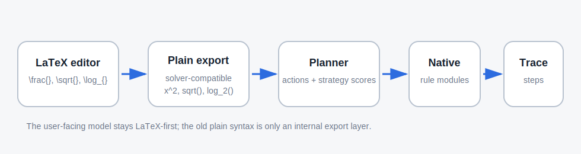
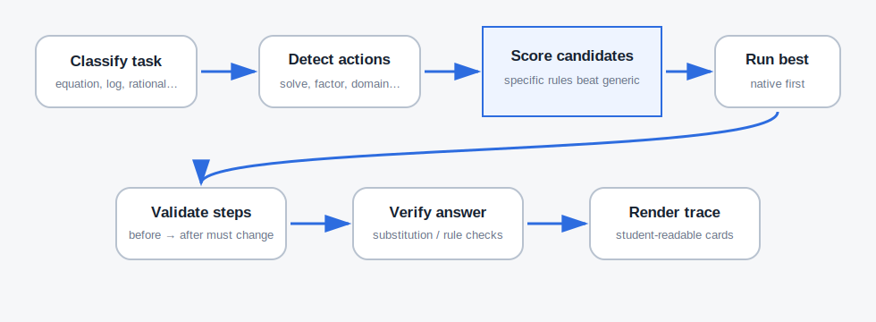

# AlgebraTrace

**AlgebraTrace** is an offline, browser-based, step-by-step mathematics solver with a LaTeX-first math editor, a rule-based JavaScript solving core, adaptive mobile UI, clean educational traces, and optional local graphing.

It is designed for learners, teachers, and developers who need a transparent local math tool that opens directly from `index.html` and does not require a server, Node.js, CDN, internet connection, backend, database, or external API.

AlgebraTrace is similar in educational intent to tools such as Photomath, Desmos, Wolfram-style calculators, and GeoGebra: the interface should feel mathematical, not like a chat bot, and the answer should show how the result is obtained. AlgebraTrace is not affiliated with any of those products.

---

## Short description

Offline LaTeX-first step-by-step math solver. Runs from local HTML/CSS/JavaScript files, renders a real editable math field, converts LaTeX to a solver-compatible internal format, chooses the best available rule strategy, and displays a student-readable solution trace.

---

## What changed in this version

This version focuses on the final editor/UI architecture:

1. **The input model is now LaTeX-first.**
   The visible editor stores LaTeX-like source such as `\frac{x+1}{x-2}`, `\sqrt{x+5}`, `\log_{2}(16)`, `x^{2}`. The solver receives a separate normalized export such as `(x+1)/(x-2)`, `sqrt(x+5)`, `log_2(16)`, `x^2`.

2. **The old “plain input + rendered preview” model is removed from the public page.**
   The user-facing field is one editable mathematical field. The developer page can still show LaTeX source and solver export for debugging.

3. **The design was rebuilt as a calculator-style interface.**
   The new CSS uses neutral panels, clear borders, compact action cards, and large touch-friendly controls.

4. **Mobile layout is supported from the start.**
   On narrow screens, input, keyboard, actions, result, and graph become a vertical mobile workflow. Keyboard buttons remain usable as touch targets.

5. **Parameterized school problems were added.**
   The native solver now detects equations in `x` with other letters treated as parameters and supports common linear/quadratic parameter cases.

6. **README was expanded with the solver pipeline and strategy-selection explanation.**
   The diagrams below are local SVG files and work offline in the repository.

---

## Quick start

Download or clone the folder and open:

```text
index.html
```

No build step is required.

You do **not** need:

```text
npm install
node
python
server
internet
CDN
backend
```

The app is intended to work directly as:

```text
file:///.../index.html
```

For diagnostics and rule details, open:

```text
dev.html
```

For the browser test runner, open:

```text
tests/test_all.html
```

Current validation target: **111 / 111 tests passing**, including **Final UI tests 12 / 12**, LaTeX pipeline, parameterized problems, step quality checks, and the school-math solver coverage tests.

---

## Input syntax

The user-facing editor accepts LaTeX-style input. The math keyboard inserts the same LaTeX source.

| Mathematical idea | LaTeX-first input | Internal solver export |
|---|---:|---:|
| Fraction | `\frac{3x+12}{x^2-16}` | `(3x+12)/(x^2-16)` |
| Square root | `\sqrt{x+5}` | `sqrt(x+5)` |
| Power | `x^{2}` | `x^2` |
| Logarithm with base | `\log_{2}(16)` | `log_2(16)` |
| Natural logarithm | `\ln(x)` | `ln(x)` |
| Trigonometric function | `\sin(x^2)` | `sin(x^2)` |
| Derivative request | `\frac{d}{dx}\sin(x^2)` | `d/dxsin(x^2)` |
| System separator | `2x+y=5; x-y=1` | `2x+y=5; x-y=1` |
| Parameter equation | `ax+b=0` or `a\cdot x+b=0` | `ax+b=0` or `a*x+b=0` |

The old plain syntax is still accepted in many places, especially in tests and developer utilities, but it is no longer the public UI model.

---

## Architecture overview



AlgebraTrace separates the **display model** from the **solver model**:

```text
Visible editor source:     \frac{3x+12}{x^2-16}
Solver export:             (3x+12)/(x^2-16)
Native solver result:      3/(x - 4), where x ≠ -4 and x ≠ 4
Rendered trace:            formatted fractions, powers, restrictions, and steps
```

This separation is important. A beautiful editor should not force the solving core to parse browser DOM. The solver should receive deterministic text that can be tested, saved, compared, and used without the UI.

The main pipeline is:

1. **LaTeX editor** stores the visible mathematical source.
2. **LaTeX renderer** draws fractions, roots, powers, subscripts, functions, and relations in the editable field.
3. **LaTeX-to-plain exporter** converts the same source into solver-compatible text.
4. **Classifier** identifies the task type: equation, rational expression, logarithm, derivative request, system, parameterized equation, etc.
5. **Action detector** proposes operations that make sense for the input.
6. **Strategy planner** builds candidate solving strategies and scores them.
7. **Native rule module** runs the best implemented strategy.
8. **Step validator** removes fake or non-transforming steps.
9. **Renderer** displays the final answer and readable transformation cards.

---

## How the editor works

The editor is intentionally lightweight and offline. It is not MathJax, KaTeX, MathQuill, a CDN widget, or a server-rendered component.

Main files:

```text
js/ui/math_editor.js      editable LaTeX field, caret, paste, keyboard insertion
js/ui/math_render.js      LaTeX rendering + LaTeX/plain conversion
js/ui/math_keyboard.js    on-screen LaTeX keyboard
css/app.css              responsive calculator-style UI
```

The editor keeps one source string:

```js
latex = "\\frac{3x+12}{x^2-16}";
```

The solving layer receives:

```js
latexToPlain(latex) === "(3x+12)/(x^2-16)";
```

The public helper methods are:

```js
getMathEditorValue();          // solver-compatible plain text
getMathEditorLatex();          // LaTeX source
setMathEditorValue("x^2=4");  // accepts plain text or LaTeX-like text
insertIntoMathEditor("\\sqrt{}", 6);
```

The important design choice is that the editable field is not a separate plain input plus a preview. The visual field is the editing field.

---

## How the best solution is selected



AlgebraTrace does not ask a language model to invent a solution. It uses deterministic rule modules. The process is closer to a small educational CAS/planner.

### 1. Classification

The classifier reads the normalized solver export and assigns a task type:

```text
x^2-5x+6=0              → quadratic_equation
(3x+12)/(x^2-16)        → rational_expression
\log_{2}(16) export      → logarithmic_expression
d/dxsin(x^2)            → derivative_request
a*x+b=0                 → parameterized_linear_equation
a*x^2+b*x+c=0           → parameterized_quadratic_equation
```

The task profile also records features such as:

```js
{
  problem_kind: "relation",
  main_variable: "x",
  is_rational: true,
  has_logarithms: false,
  has_radicals: false,
  has_parameters: true,
  domain: "real"
}
```

### 2. Action detection

The action detector decides what operations should be shown to the user. For example:

```text
x^2-5x+6=0
→ solve, graph

(3x+12)/(x^2-16)
→ simplify, find_domain, differentiate, find_asymptotes, find_discontinuities, graph

a*x+b=0
→ solve_with_parameters, analyze_parameters, solve, graph
```

This keeps the UI from offering irrelevant actions. A quadratic equation should not primarily show “simplify”; it should show “solve”.

### 3. Candidate strategy generation

Each action can have multiple possible strategies. A quadratic equation may be solvable by factoring or by the quadratic formula. A rational expression may be simplified by factoring and canceling. A parameterized quadratic requires cases.

Examples:

```js
planStrategies("x^2-5*x+6=0", "solve", "quadratic_equation")
→ [
  { id: "quadratic_factorization", score: 100 },
  { id: "quadratic_formula", score: 70 }
]
```

```js
planStrategies("a*x^2+b*x+c=0", "solve_with_parameters", "parameterized_quadratic_equation")
→ [
  { id: "parameterized_quadratic_discriminant_cases", score: 100 }
]
```

The strategy with the highest score is selected unless the native module reports that the pattern is unsupported.

### 4. Native-first execution

The native solver modules are tried before compatibility records. The current native modules are organized by topic:

```text
js/solvers/algebra.js
js/solvers/equations.js
js/solvers/inequalities.js
js/solvers/rational.js
js/solvers/powers_roots.js
js/solvers/logarithms.js
js/solvers/trigonometry.js
js/solvers/derivatives.js
js/solvers/derivative_applications.js
js/solvers/integrals.js
js/solvers/systems.js
js/solvers/function_properties.js
js/solvers/limits_continuity.js
js/solvers/parameters.js
```

The dispatcher works approximately as:

```js
if (hasParameters && action is solve/analyze_parameters) {
    use parameter solver;
}
else if (hasLogarithms && action is logarithm-related) {
    use logarithm solver;
}
else if (action === "find_domain") {
    use rational/domain solver;
}
else if (action === "solve") {
    use equation/inequality solver;
}
else if (action === "differentiate") {
    use derivative solver;
}
...
else {
    return unsupported result;
}
```

### 5. Step construction

A step is expected to be educational, not just diagnostic. A good step has:

```js
{
  step_type: "transform",
  rule_id: "difference_of_squares",
  action: "Factor as a difference of squares",
  before: "x^2 - 16",
  after: "(x - 4)*(x + 4)",
  explanation: "The expression has the form a^2 - b^2."
}
```

Bad placeholder steps are filtered out. A step should not merely say:

```text
Apply rule_x
Native JavaScript rule-based transformation.
```

unless there is also a real mathematical before/after transformation or a valid reasoning/domain step.

### 6. Verification and fallback

Native results include a verification object. For equations this can include substitution checks; for integrals, differentiation of the antiderivative; for rational simplification, domain preservation. Compatibility records are only a safety net for legacy examples, not the primary solution path.

---

## Parameterized problems

The parameter module treats `x` as the main unknown and other letters as parameters.

### Linear parameter equation

Input:

```text
a*x+b=0
```

Result structure:

```text
if a ≠ 0: x = -b/a;
if a = 0 and b = 0: every real x;
if a = 0 and b ≠ 0: no solution
```

The solver explicitly splits the degenerate case where the coefficient of `x` becomes zero.

### Quadratic parameter equation

Input:

```text
a*x^2+b*x+c=0
```

Result structure:

```text
if a ≠ 0 and D > 0: two real roots;
if a ≠ 0 and D = 0: one double root;
if a ≠ 0 and D < 0: no real roots;
where D = b^2 - 4ac;
if a = 0: reduce to the linear parameter case.
```

### Square equals parameter

Input:

```text
x^2-a=0
```

Result structure:

```text
if a > 0: x = -sqrt(a) or x = sqrt(a);
if a = 0: x = 0;
if a < 0: no real solution.
```

These are the most common school-level parameter cases. More complex parameter inequalities and mixed systems can be added by extending `js/solvers/parameters.js` with additional case analyzers.

---

## School-program coverage checklist

The current implementation is aimed at broad secondary-school coverage, with the important limitation that AlgebraTrace is a rule-based educational solver, not a full CAS. It supports implemented patterns in each topic; it does not claim universal symbolic completeness.

| Area | Status | Notes |
|---|---:|---|
| Arithmetic expressions | Supported | Order of operations, exact/simple numeric output. |
| Linear equations | Supported | Numeric and parameterized cases. |
| Quadratic equations | Supported | Factoring, square cases, parameterized discriminant cases. |
| Linear inequalities | Supported | Sign/interval output for implemented patterns. |
| Quadratic inequalities | Supported | Sign chart for implemented polynomial patterns. |
| Rational expressions | Supported | Simplification, cancellation, forbidden values. |
| Rational equations/inequalities | Supported | Denominator restrictions and sign charts for implemented cases. |
| Absolute value equations/inequalities | Supported | Standard split/interval cases. |
| Powers and roots | Supported | Roots, square roots, simple radical equations. |
| Exponential equations | Supported | Same-base and logarithmic answer patterns. |
| Logarithms | Supported | Numeric simplification, domain, expansion/combination, simple equations. |
| Trigonometry | Partly supported | Basic identities and simple relations; full general trigonometric solving is not complete. |
| Systems of equations | Supported | Linear 2×2 systems and selected simple systems. |
| Functions and graphs | Supported | Local canvas graphing, domain, range/asymptote patterns, function analysis. |
| Derivatives | Supported | Rule-based derivatives and applications. |
| Integrals | Partly supported | Basic antiderivatives and selected definite/area tasks. |
| Limits and continuity | Supported for common patterns | Direct substitution, removable discontinuities, infinity behavior patterns. |
| Parameterized problems | Newly supported | Common linear/quadratic school cases. |

---

## UI principles

The UI is intentionally closer to a calculator than to a chat product:

- no decorative gradient background;
- no “AI assistant” framing;
- no conversational prompt chrome;
- one dominant math editor;
- clear action cards;
- result-first solution layout;
- developer details only in `dev.html`;
- responsive mobile stack;
- touch-friendly keyboard buttons.

The public page hides raw JSON, internal strategy IDs, and compatibility-source markers. The developer page keeps them visible.

---

## File structure

```text
index.html                     user-facing app
dev.html                       developer/debug app
css/app.css                    design system and responsive layout
js/ui/math_editor.js           LaTeX-first editable field
js/ui/math_render.js           LaTeX renderer and converter
js/ui/math_keyboard.js         on-screen math keyboard
js/ui/app.js                   UI orchestration
js/ui/graph.js                 local canvas graphing
js/algebra_trace.js            public solve/listActions API and dispatcher
js/actions.js                  action detection
js/classifier.js               task classification
js/strategy.js                 strategy planning/scoring
js/renderer.js                 solution HTML renderer
js/solvers/*.js                native rule modules
tests/test_all.html            local browser test runner
docs/*.svg                     local architecture diagrams
```

---

## Public API

The stable high-level API remains:

```js
solve(input, options)
listActions(input)
renderSolution(result)
```

Examples:

```js
solve("x^2 - 5*x + 6 = 0")
solve("(3*x + 12)/(x^2 - 16)", { action: "simplify" })
solve("a*x+b=0", { action: "solve_with_parameters" })
listActions("a*x^2+b*x+c=0")
```

Editor helpers:

```js
getMathEditorValue();
getMathEditorLatex();
setMathEditorValue("\\frac{x+1}{x-2}");
insertIntoMathEditor("\\sqrt{}", 6);
```

---

## Development notes

- Keep the app offline and local-file friendly.
- Do not add CDN dependencies.
- Do not require Node.js for normal use.
- Preserve `solve(input, options)`, `listActions(input)`, and `renderSolution(result)`.
- When adding a new solver rule, add meaningful `before` and `after` fields.
- Avoid compressed one-step explanations when an educational trace needs intermediate transformations.
- Prefer native rule modules over compatibility records.
- For school tasks with parameters, always split degenerate cases explicitly.

---

## Limitations

AlgebraTrace is still a rule-based educational solver. It is not a complete CAS. Unsupported expressions should return a clear “operation unavailable” message rather than a fake solution. This is intentional: transparent partial coverage is better than unreliable symbolic output.

The most important future extensions are:

- richer parameter inequalities;
- more complete trigonometric equation families;
- broader symbolic factoring;
- more robust multi-variable systems;
- selection editing inside the LaTeX field;
- optional mobile WebView packaging.

---

